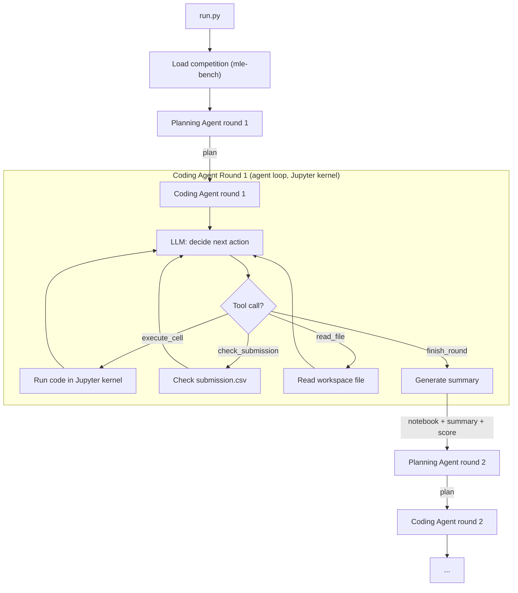
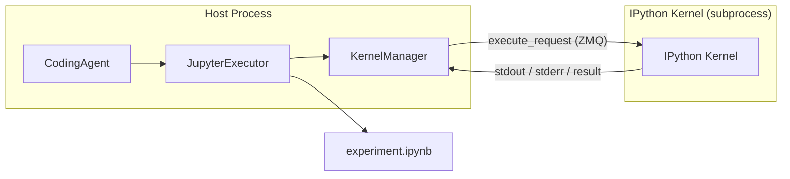

# mlAgent — Planning-Coding Agent Framework (MLE-bench)

Dual-agent framework for MLE-bench: a **Planning agent** with long-term memory orchestrates rounds, while a **Coding agent** runs a full agent loop with real Jupyter kernel execution within each round. Reuses competition/grading module and mle-bench infrastructure.

**依赖**：本仓库 `pip install -e .`；与仓库同级的 **`mle-bench`**（`../mle-bench` 会加入 `sys.path`，或已安装 `mlebench`）；`jupyter_client` / `ipykernel` / `nbformat` / `psutil` 等见 `pyproject.toml`。ML 实验环境与跑 mle-bench 时一致即可。

---

## High-Level Architecture

Two agents alternate in a loop. The Planning agent persists across all rounds; the Coding agent runs a full autonomous agent loop within each round (with tools, multi-turn LLM, Jupyter kernel), then resets its LLM history between rounds.



### Planning Agent (`mlagent/planning_agent.py`)

- LLM with `keep_history=True` — conversation persists **across all rounds**
- Round 1 input: competition description, data preview, metric info
- Round N input: previous round's summary (metrics, what worked/failed, notebook state) appended as a new user message
- Output: structured plan/instructions for the next Coding round
- Writes key decisions and metrics to `experiment_log.json` for persistence beyond LLM context window

### Coding Agent (`mlagent/coding_agent.py`)

- LLM with `keep_history=True` **within a single round**, reset between rounds
- Full agent loop: LLM generates tool calls → tool executes → result returned → LLM decides next action → ... until `finish_round` or step limit
- **Tools:**
  - `execute_cell(code, timeout)` — run code in the persistent Jupyter kernel
  - `check_submission()` — check if submission.csv exists and is valid
  - `read_file(path, max_lines)` — read a file from the workspace
  - `finish_round(summary)` — signal round completion
- The **Jupyter kernel persists across rounds** — variables, loaded data, trained models stay in memory. Only the LLM conversation history resets.

---

## Jupyter Kernel Executor (`mlagent/jupyter_executor.py`)

A persistent IPython kernel managed via `jupyter_client.KernelManager`.



**Responsibilities:**

1. **`start_kernel()`** — start IPython kernel in the working directory with correct `CUDA_VISIBLE_DEVICES`. Data dir symlinked as `input/`.
2. **`execute_cell(code, timeout)`** — send code via `KernelClient.execute()`, collect outputs from iopub channel (stdout, stderr, display_data, error tracebacks). Per-cell timeout.
3. **`save_notebook()`** — after each cell, append cell + outputs to the `.ipynb` (using `nbformat`).
4. **`restart_kernel()`** — if kernel crashes or OOMs, restart it. State is lost but notebook records everything.
5. **`shutdown()`** — at end of run.

---

## mle-bench Environment Integration

- `Competition.from_mlebench(competition_id)` loads competition, downloads/prepares data if needed, reads description
- `competition.grade(submission_path)` grades submission.csv via mle-bench
- `competition.data_dir` gives the public data directory (symlinked into workspace as `input/`)
- `competition.get_data_preview()` generates a text preview for the LLM

mle-bench is resolved via sibling path: `Path(__file__).parents[2] / "mle-bench"`. Competition data cached at `~/.cache/mle-bench/data/`. GPU selection: auto-detect via `nvidia-smi` or explicit in config.

---

## Project Structure

```
mlAgent/
├── mlagent/
│   ├── __init__.py
│   ├── orchestrator.py         # Main loop: Planning <-> Coding round alternation
│   ├── planning_agent.py       # Planning agent (long-term memory across rounds)
│   ├── coding_agent.py         # Coding agent (full agent loop with tools, per-round)
│   ├── jupyter_executor.py     # Persistent Jupyter kernel manager
│   ├── llm.py                  # LLM client (adapted from myAgent, with tool calling)
│   ├── config.py               # Config dataclasses + YAML loading (OmegaConf)
│   ├── competition.py          # mle-bench 加载与评分
│   ├── competition_loader.py   # 薄封装
│   ├── data_preview.py         # 数据预览（规划用）
│   └── utils.py                # Logging, prompt tracing, summary generation
├── configs/
│   └── default.yaml
├── scripts/
│   ├── run.py                  # Entry point
│   ├── smoke_test.py
│   └── pull_run.sh             # Pull results from remote
├── prompts/                    # (如使用 JSON 模板)
├── workspace/                  # Per-run dirs (gitignored)
└── README.md
```

---

## Config (`configs/default.yaml`)

```yaml
competition_id: spooky-author-identification

jupyter:
  kernel_name: python3
  cell_timeout: 600
  gpu: "auto"

planning_llm:
  model_name: gpt-5.1-codex-mini
  api_key: ""       # or set OPENAI_API_KEY env
  temperature: 1.0
  max_tokens: 100000
  keep_history: true

coding_llm:
  model_name: gpt-5.1-codex-mini
  api_key: ""
  temperature: 1.0
  max_tokens: 100000
  keep_history: true   # within round; reset between rounds by CodingAgent

max_rounds: 10
max_steps_per_round: 20
total_time_limit: 14400
```

---

## Core Flow (`mlagent/orchestrator.py`)

```python
async def run(config):
    competition = Competition.from_mlebench(config.competition_id)
    jupyter = JupyterExecutor(
        work_dir=run_dir,
        data_dir=competition.data_dir,
        gpu=config.jupyter.gpu,
    )
    planner = PlanningAgent(config.planning_llm, competition)
    exp_log = ExperimentLog(run_dir / "experiment_log.json")

    last_summary = None
    best_score = None

    for round_num in range(1, config.max_rounds + 1):
        # --- Planning phase ---
        plan = planner.plan(round_num, last_summary)

        # --- Coding phase (full agent loop) ---
        coder = CodingAgent(config.coding_llm)  # fresh LLM each round
        summary = await coder.run_round(
            plan=plan,
            competition=competition,
            jupyter=jupyter,
            round_num=round_num,
            max_steps=config.max_steps_per_round,
        )

        # --- Grading ---
        grade_report = competition.grade(run_dir / "submission.csv")
        if grade_report.valid_submission:
            if best_score is None or ...:
                best_score = grade_report.score

        # --- Prepare for next round ---
        last_summary = format_summary(summary, grade_report, best_score)
        exp_log.log_round(round_num, plan, last_summary, grade_report)

    jupyter.shutdown()
```

---

## LLM Client (`mlagent/llm.py`)

- `chat_with_tools(tools, ...)` — OpenAI tool calling flow (send tools list, receive tool_call response, feed back tool results)
- `reset_history()` — for Coding agent round boundaries
- Codex model support and prompt caching

---

## Experiment Logging and Traceability

- **Prompt traces**: every LLM call saved to `debug_prompts/{counter:04d}_{agent}_{round}.txt`
- **Experiment log**: `experiment_log.json` updated each round with round number, plan, summary, metrics, score, duration, cell count
- **Notebook**: `experiment.ipynb` is a real Jupyter notebook with all cells + outputs
- **Run directory**: `workspace/run_{timestamp}_{competition}/` contains everything
- **Sync**: `scripts/pull_run.sh` pulls results from server; workspace is gitignored

---

## Notes and Risks

1. **Kernel state corruption**: if the Coding agent causes a kernel crash, `restart_kernel()` handles it but state is lost. The notebook records all cells for potential replay.
2. **Memory accumulation**: the kernel holds all variables across rounds. Large datasets or many models may exhaust RAM. The Coding agent can `del` objects; optionally, kernel restart between rounds can be configured.
3. **LLM context growth**: Planning agent history grows each round. For 10+ rounds, may need to summarize older rounds.
4. **Cell timeout**: long training runs need appropriate per-cell timeouts (configurable, default 600s).
5. **Dependencies on server**: `jupyter_client`, `ipykernel`, `nbformat` must be installed in the conda env alongside ML packages.

---

## Quick Start

```bash
cd mlAgent
pip install -e .
# 同级 mle-bench + Kaggle 配置见 mle-bench 文档
```

## 自检（跑实验前）

```bash
cd ~/path/to/mlAgent
pip install -e .

python scripts/smoke_test.py
# 或只测配置 + Competition 加载（不跑 Jupyter / LLM）
python scripts/run.py --check-only
```

Competition 加载失败时：检查 **`../mle-bench`** 是否存在或已安装、**`~/.kaggle/kaggle.json`**。

---

## Running

```bash
python scripts/run.py --config configs/default.yaml --competition spooky-author-identification
```

```bash
python scripts/run.py max_rounds=5 max_steps_per_round=15 coding_llm.model_name=gpt-5.1-codex-mini
```

## Running on Server

```bash
cd /path/to/mlAgent && git pull
pip install -e .
export OPENAI_API_KEY=...
python scripts/run.py --config configs/default.yaml --competition spooky-author-identification
```

```bash
ssh user@server
tmux new -s mlagent
cd /path/to/ai4mle-research/mlAgent

export OPENAI_API_KEY=...

nohup python -u scripts/run.py --config configs/default.yaml --competition spooky-author-identification > mlagent_run.log 2>&1 &
tail -f mlagent_run.log

# 停止
pkill -f "python scripts/run.py"
```

可选 rsync 同步（无 Git 时）：

```bash
rsync -avz --exclude '.git' --exclude '__pycache__' --exclude '*.egg-info' --exclude 'workspace' \
  ~/Desktop/ai4mle-research/mlAgent/ user@host:/path/to/mlAgent/
```

---

## CLI

| Arg | Default | Description |
|-----|---------|-------------|
| `--config` | `configs/default.yaml` | YAML |
| `--competition` | from YAML | 覆盖 `competition_id` |
| `--check-only` | — | 只加载配置 + Competition |
| `overrides` | — | OmegaConf，如 `max_rounds=3` |

---

## GitHub Sync & Pull Workspace

`workspace/` 已在 `.gitignore`。

**本机（首次）**

```bash
cd ~/Desktop/ai4mle-research/mlAgent
git init && git add . && git commit -m "Initial mlAgent"
git remote add origin https://github.com/<用户>/<仓库>.git
git branch -M main && git push -u origin main
```

**服务器（首次）**

```bash
cd /path/to/ai4mle-research
git clone https://github.com/<用户>/<仓库>.git mlAgent
cd mlAgent && pip install -e .
```

**日常**：本机 `git push`；服务器 `git pull`。

**从服务器拉回 run 目录：**

```bash
bash scripts/pull_run.sh pull
bash scripts/pull_run.sh pull "20260312_021700" --clear
bash scripts/pull_run.sh clear
```

```bash
# 远端清空 workspace 示例
ssh user@server 'cd /path/to/mlAgent && rm -rf workspace/* && rm -f mlagent_*.log'
```

---

## Requirements

- Python 3.10+
- **mle-bench**（同级 `../mle-bench` 或已安装）
- `~/.kaggle/kaggle.json`（下载赛题数据）
- `OPENAI_API_KEY`（或写在 YAML，勿提交密钥）
- GPU 推荐
